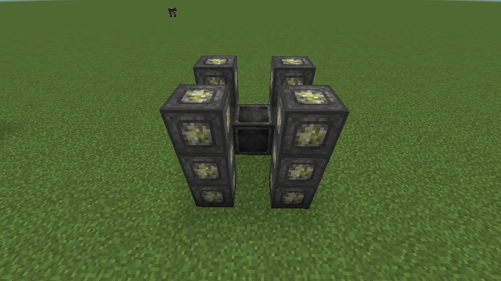

#Ritual of High Jump
This ritual looks for any living entity that is above the MRS and then shoots them into the air. If a person is pressing shift, the person will be able to land safely without being sent flying.

###Structure
This ritual needs the following blocks:

  * 1x Master Ritual Stone
  * 6x Ritual Stone of Air

In this formation:

###Cost
This ritual costs 5,000LP to activate and 5LP per operation.
