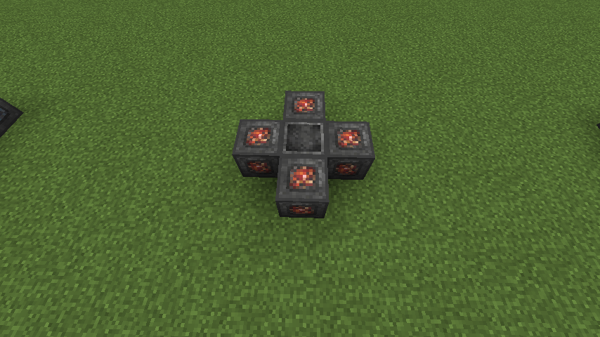

#Serenade of the Nether
This ritual is slightly more sinister than its cousin, The Serenade of the Nether draws lava from across dimensions and generates a source block of lava on top of the MRS.

###Structure
This ritual needs the following blocks:

  * 1x Master Ritual Stone
  * 4x Ritual Stone of Fire

In this formation:

###Cost
This ritual has an activation cost of 10,000LP and a refresh cost of 500LP per lava source block. This ritual can run your network dry if you use it too quickly.
